# Kubernetes Monitoring

## Introduction

With over 40.000 stars on Github, more than 70.000 commits, having major contributors like Google and Redhat, Kubernetes has taken over the container ecosystem so rapidly to become the true leader when it comes to container orchestration platforms. It orchestrates computing, networking and storage infrastructure. Also, it's main purpose is to manage containerized applications in a cluster of nodes and to facilitate their deployment, scaling, updating, maintenance or service discovery.

**Understanding Kubernetes and its abstractions**

At an **infrastructure/physical level**, a Kubernetes cluster is a set of physical/virtual machines made up of two types of components: a Master and some Nodes. The Master is considered to be the "brain" of all operations, being in charge with container orchestration across nodes.

- [Master components](https://kubernetes.io/docs/concepts/overview/components/#master-components) manage the lifecycle of a Pod. If a Pod dies, the Controller creates a new one, if you scale up/down Pods the Controller creates/destroys your Pods. Components that live inside a Master node:
    - kube-apiserver, exposes APIs for the other master components.
    - etcd, consistent and highly-available key value store used as Kubernetes’ backing store for all cluster data.
    - kube-scheduler, decides for newly created pods what Node they should run on.
    - kube-controller-manager, responsible with node management (in case node goes down), pod replication, endpoint creation
    - cloud-controller-manager, runs controllers that interact with the underlying cloud providers. 
    
- [Node components](https://kubernetes.io/docs/concepts/architecture/nodes/#what-is-a-node) are worker machines in Kubernetes, managed by the Master. A node may be a virtual machine (VM) or physical machine, depending on the cluster. Each node contains the necessary components to run pods:
    - [kubelet](https://kubernetes.io/docs/reference/command-line-tools-reference/kubelet/), is the agent in charge with communication between Master and Node.
    - [kube-proxy](https://kubernetes.io/docs/reference/command-line-tools-reference/kube-proxy/), is in charge with communication between Pods.
    - container runtime, software responsible for running containers, most widely known today being [Docker](https://www.docker.com)

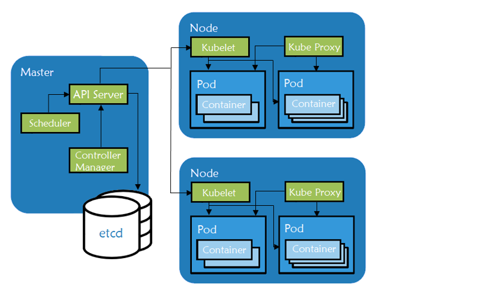

On the **logical** point of view, this is how a Kubernetes deployment looks like:

- [Pods](https://kubernetes.io/docs/concepts/workloads/pods/pod/), are units that control one or more containers, scheduled as one application. Typically you should create one Pod per application, so you can scale and control them separately.
- [Services](https://kubernetes.io/docs/concepts/services-networking/service/), abstraction for a set of Pods and a policy to access them. The set of Pods targeted by a Service is (usually) determined by a [Label Selector](https://kubernetes.io/docs/concepts/overview/working-with-objects/labels/).
- [ReplicaSets](https://kubernetes.io/docs/concepts/workloads/controllers/replicaset/), are controlled by Deployments and ensure that a specified number of pod replicas are running at any one time.
- [Namespaces](https://kubernetes.io/docs/concepts/overview/working-with-objects/namespaces/), virtual clusters backed by the same physical cluster that can include one or more services.
- Metadata, used to mark containers based on their deployment characteristics.

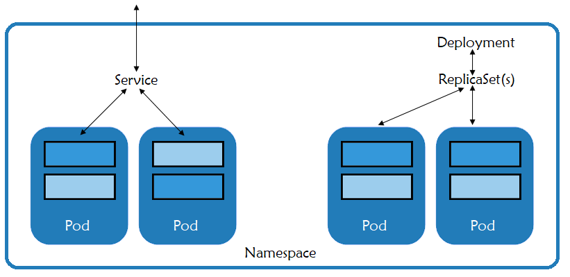

## Monitoring Kubernetes

Multiple services and multiple namespaces can be spread across the infrastructure. As seen above each of the services are made of Pods, which can have from one to many containers. Even for a small Kubernetes cluster monitoring can become pretty challenging. Also you need to understand what the application does, how it functions in order to be able to monitor it effectively.

Some basic tools that allow monitoring the cluster:
- [Probes](https://kubernetes.io/docs/tasks/configure-pod-container/configure-liveness-readiness-probes/), are in charge with regularly monitoring the health of a container/service. In case of unhealthy they can take action, from restarting the container up to removing the Pod from a Service.
- cAdvisor, open source container resource usage and performance analysis agent, integrated with the Kubelet binary. It collects, aggregates, processes and exports metrics (CPU, memory, file and network usage) about running containers on a given node.
- [kubernetes dashboard](https://kubernetes.io/docs/tasks/access-application-cluster/web-ui-dashboard/), add-on which gives an overview of applications running on your cluster, as well as for creating or modifying individual Kubernetes resources

The great thing about Kubernetes is its capability of auto-healing. It can automatically restart containers for us if there is a process crash and can redistribute pods if there is a node failure. Still there are moments when Kubernetes cannot fix the problem for us, so we do need monitoring in order to get a clear pictures of what's happening with the cluster.

## Layers to monitor:
1. Infrastructure, we need to have at least basic monitoring at server side so we can check that everything works as expected. Having unhealthy servers can affect the workloads running on top
    - node resource utilization 
        - CPU, shows us cluster's processing capacity
        - memory, to ensure we're not hitting performance issues by using swap for example
        - disk, to see if there is enough disk space to run apps or store data/logs
        - network bandwidth, to check for any latency
    - number of nodes - so we can take action to scale up if needed, or scale down if resources are not being used
    - running pods - offers an overview on how pods are spread among the nodes; if one node dies the rest of the pods should be able to handle the traffic
2. Kubernetes services, we need to make sure that all components living inside Kubernetes are up and doing their job properly. For example, we need to keep an eye on etcd, the data store for all cluster's resources and state and the one in charge with keeping the cluster in sync.

3. Containers/pods, it's a combination between the metrics provided by Kubernetes and the app itself. We can check the number of Pods a Workload has at some point, it's desired state, container metrics (CPU, memory, usage) or application specific metrics relevant to it's purpose.

Metrics are important so we can understand what is happening not only with Kubernetes itself but with the application running inside it too.
Kubernetes is so complex and due to the big number of things to take in consideration in regards to monitoring, even for experienced users this can look overwhelming.

## Monitoring with Rancher
Let's see how Rancher can come in handy and help us monitor the cluster. Rancher is an open source container manager used to run Kubernetes in production providing:
- common infrastructure management across multiple clusters and clouds
- easy-to-use interface for Kubernetes configuration, deployment and monitoring
- integration/configuration support with Prometheus and Grafana

### Prerequisites
- Linux box where Rancher will be running
- a Google Cloud Platform account, free tier is more than enough
- a kubernetes cluster, this demo uses Google's GKE but any other [provider](https://rancher.com/docs/rancher/v2.x/en/cluster-provisioning/hosted-kubernetes-clusters/) works the same. 

### Starting a Rancher 2.0 instance

To begin, start a Rancher 2.0 instance. There is a very intuitive getting started guide for this purpose [here](https://rancher.com/quick-start/).
Let’s create a hosted Kubernetes cluster and wait for it to turn `Active`. As soon as it's ready click on it so you can see details in Dashboard tab. Right from the beginning Rancher shows you an overview on CPU, memory and number of pods running.

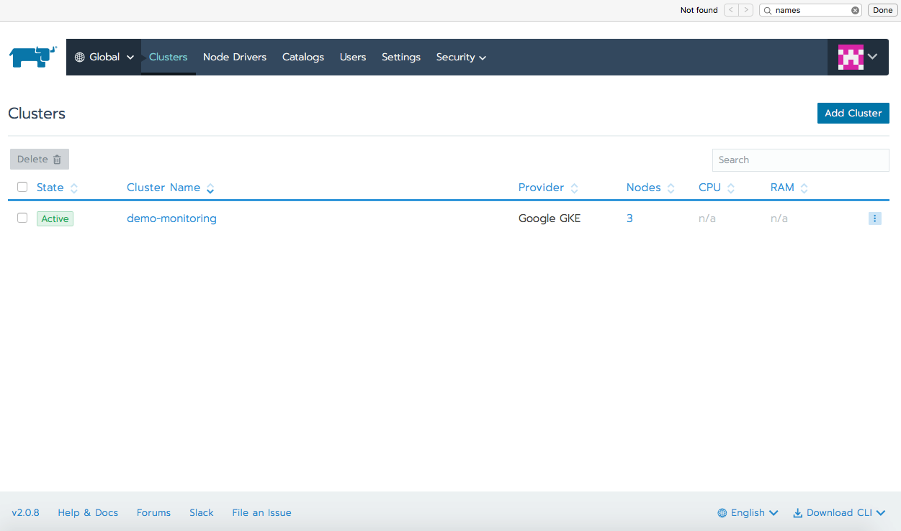
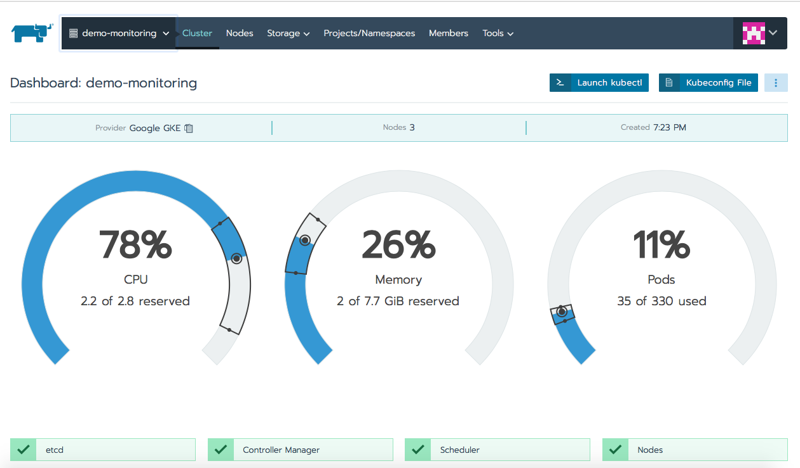

Let's Click on Nodes tab so we can explore details for all our Nodes forming the clusters. By clicking on a particular node we will be shows details only about that selection.

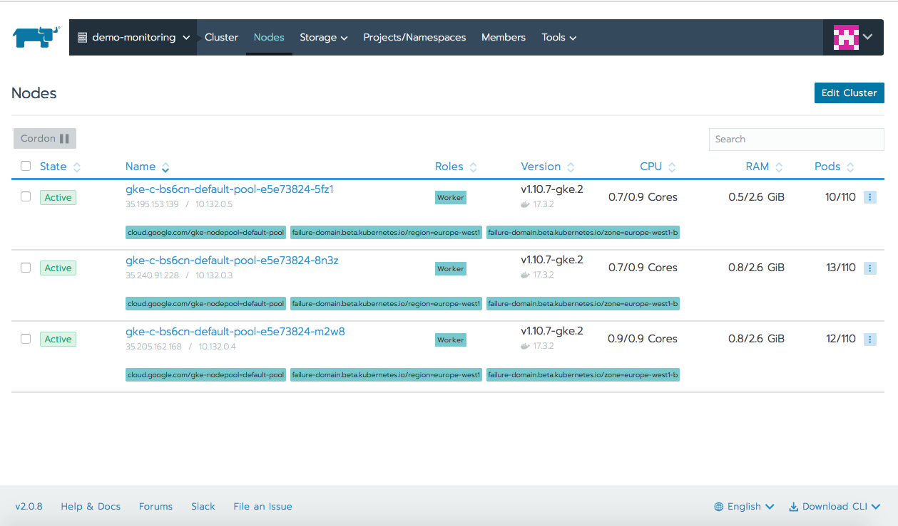
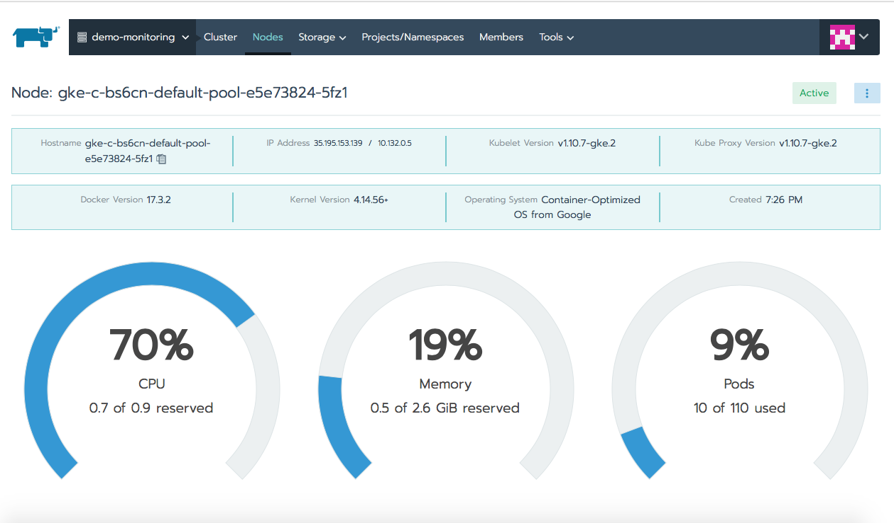

As we saw some basic metrics regarding the infrastructure, let's go now and check details regarding our Workloads. In the Workloads tab we have some starting information. We can see that we have a namespace called `default` and one deployment with 5 Pods called `nginx`. Clicking on `nginx` we can see all the pod names, what node are they running on, and their IP address. Clicking on the pod itself, we'll get us information strictly related to that selection. Scrolling down the window we can see events related to this pod (how it was started, created, scheduled etc.) and it's status (initialized, scheduled, ready)

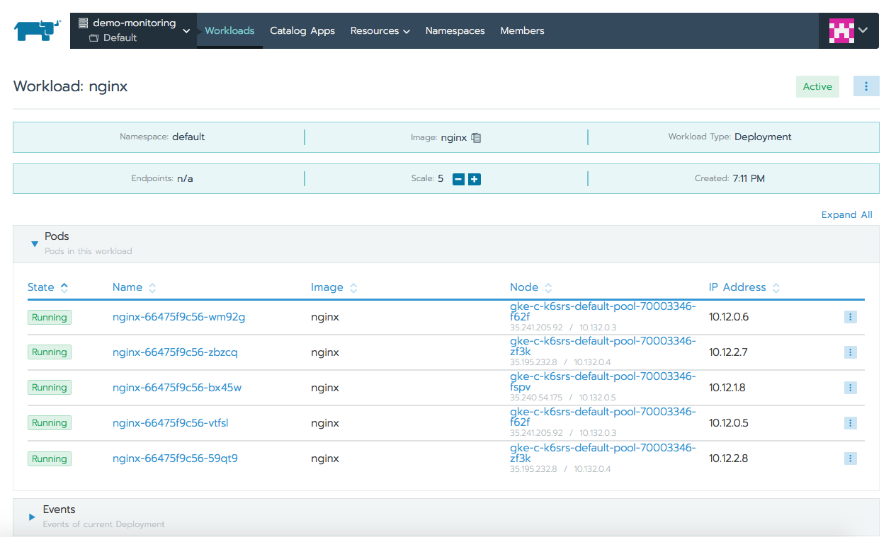

Have a look around, as by clicking on the different remaining tabs, you can see information related to `Load Balancing` (find your public IP if you have Layer-4 Load Balancer), to `Service Discovery`, or to `Volumes` (maybe have pods using storage).

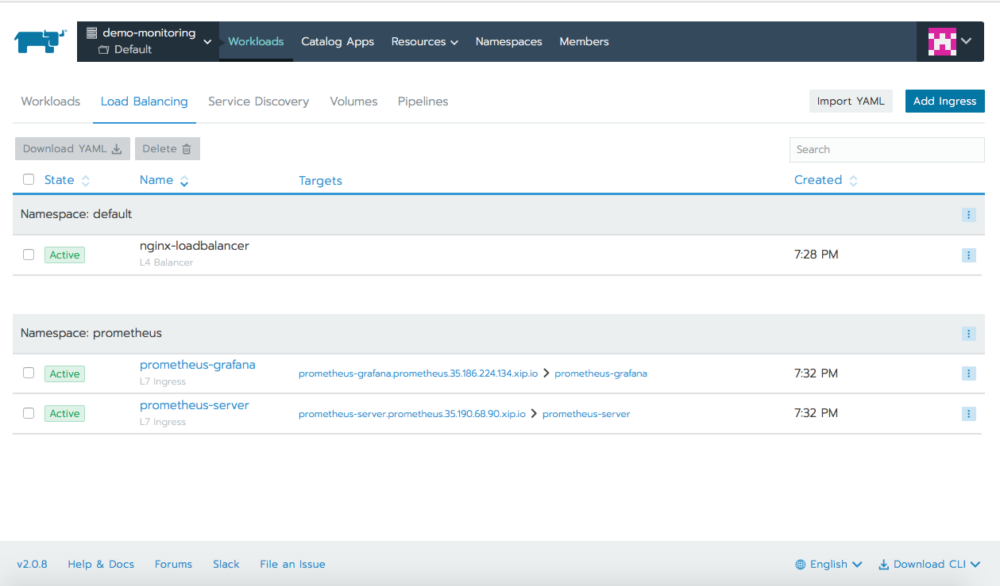
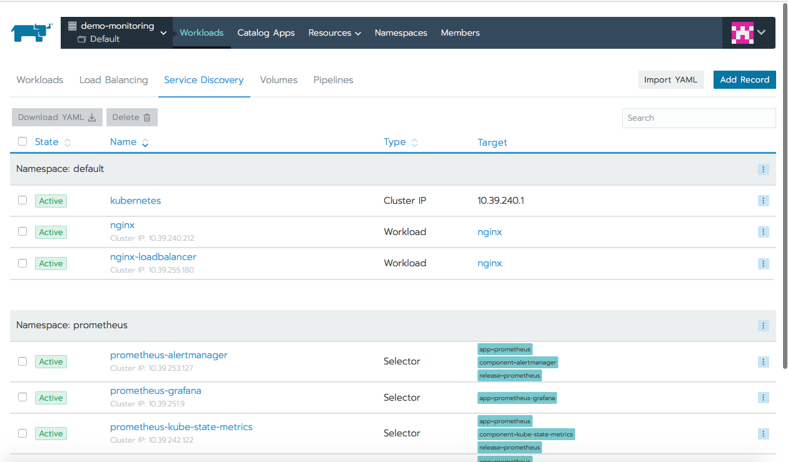

## Implement monitoring in Rancher with Prometheus
Let's go now a step forward and use a real dedicated software for monitoring. Assuming that we run a production environment this will be more than needed. Let's see how we can make use of Prometheus and Grafana.

[**Prometheus**](https://prometheus.io) is an open-source systems monitoring and alerting, being one of the popular CNCF projects. It can monitor almost anything, from an entire Linux server, to a stand-alone Apache server, a database service or a single process. The things Prometheus monitors are called **Targets** and each unit of a target is called **a metric**. It scrapes targets at a set interval to collect metrics and store them in a **time-series database**. Metrics about targets can be queried using [PromQL](https://prometheus.io/docs/prometheus/latest/querying/basics/) query language.

[**Grafana**](https://grafana.com) is an open-source, general purpose dashboard and graph composer, which runs as a web application. It supports any time series database as backend. It is used as a visualization layer on top of Prometheus, being able to query metrics stored in the Prometheus time-series database. The result is displayed in the Grafana Dashboard as a whole, as we will shortly see.

Now that we briefly described the two, we want to use them, but still we are reluctant because of the overhead they add. We have to configure them, to set them up, maybe even tune them.
Here comes the beauty, Rancher can do all these for us and this is just a click away. Let's check!

### Install Prometheus and Grafana

In `Catalog Apps` search for Prometheus and click on the result (getting it installed will automatically install Grafana too). You can leave everything as default and click Launch, both sections `PROMETHEUS SERVER` and `GRAFANA SETTINGS` are pre-filled.
It will take around 5 minutes until all your Workloads and Services get configured.

As soon as they're ready we can see all created workloads in `Active` state under `prometheus` namespace.
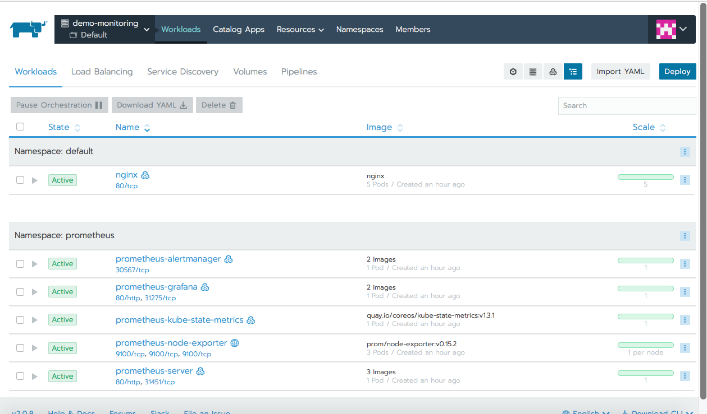

Let's go in `Load Balancing` tab to see how we can access the two. We can see the two L7 ingress rules and their associated public URLs, thanks to [xip.io](xip.io). Let's open Grafana console by accessing its URL.
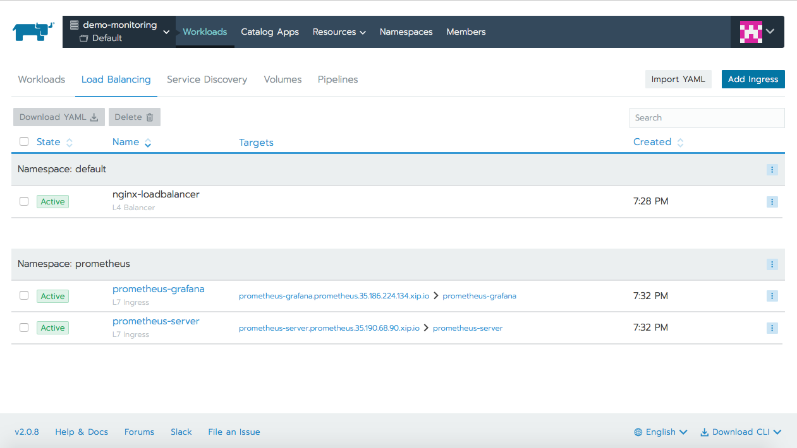

As you can see, everything is already configured for us. We didn't need to specify anything related to our cluster or our workloads. Rancher behind the scene has made all the hard work and we can now take advantage of this. Let's see how Grafana looks having these nice graphs populated with metrics from Prometheus.
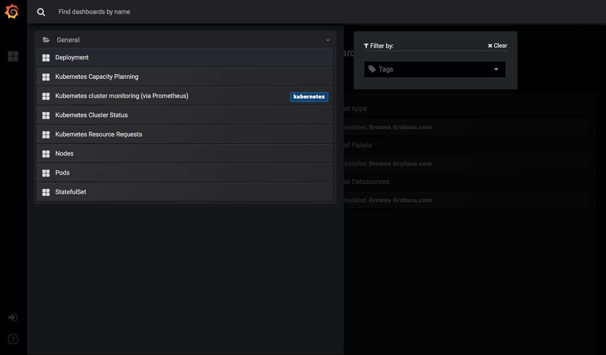

We have here a bunch of information related to: 
- Kubernetes Cluster Status
- Kubernetes Cluster Monitoring (via Prometheus)
- Nodes
- Pods
- Deployment (nginx in our case) with current number of replicas

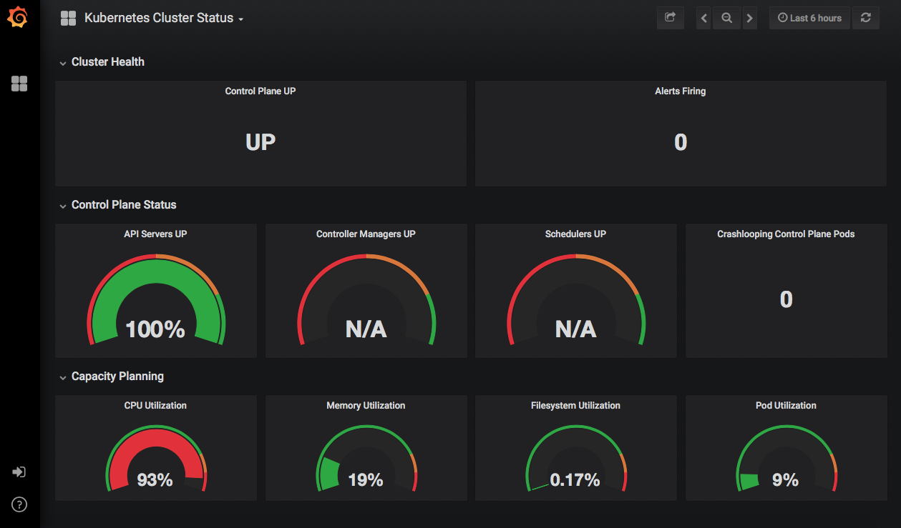

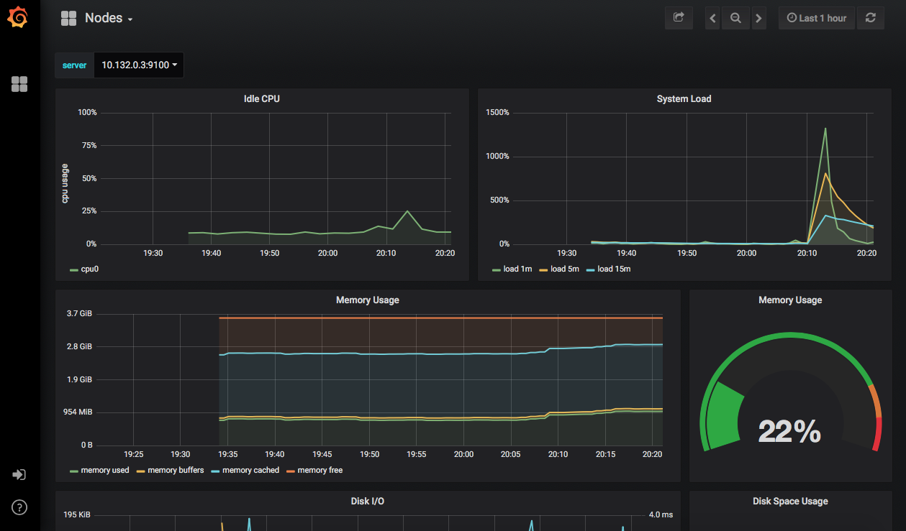

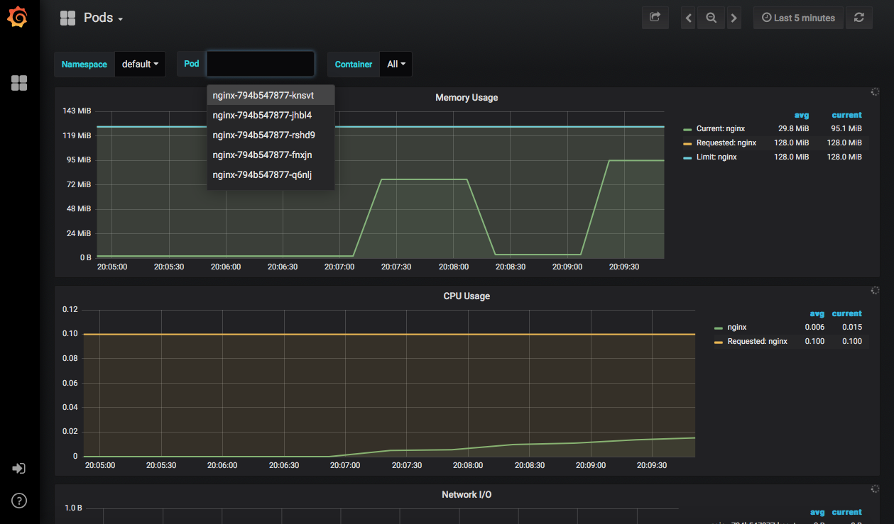
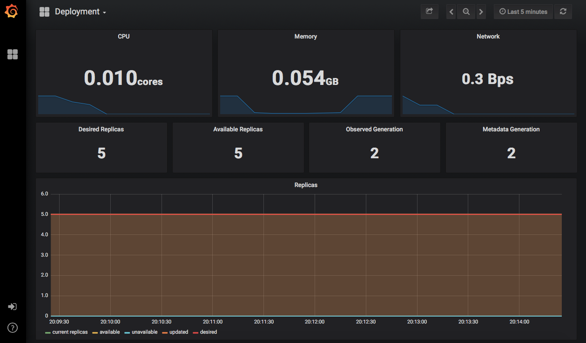

## Conclusion

Let's recap our exercise:
- we created a clusters using Rancher
- we deployed workloads having a deployment of 5 Pods (nginx)
- we navigated on numerous tabs Rancher provides so we can see metrics relevant to our cluster/pods
- we installed and used Prometheus and Grafana

Prometheus is a very useful application addressing monitoring microservices. As it's not a dashboard solution it relies on Grafana for dashboarding, helping developers inspect their infrastructure and applications in a production or dev environment. 
If you are looking for a monitoring tool or solution you can give Prometheus and Grafana a try. You can install them on your own, or as we saw in the demo, you can get these two up to speed in no-time using [Rancher](https://rancher.com/).
